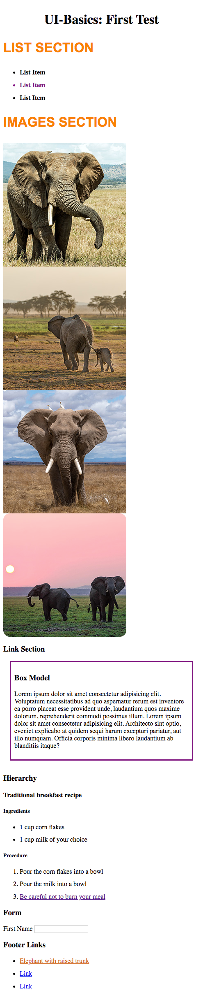
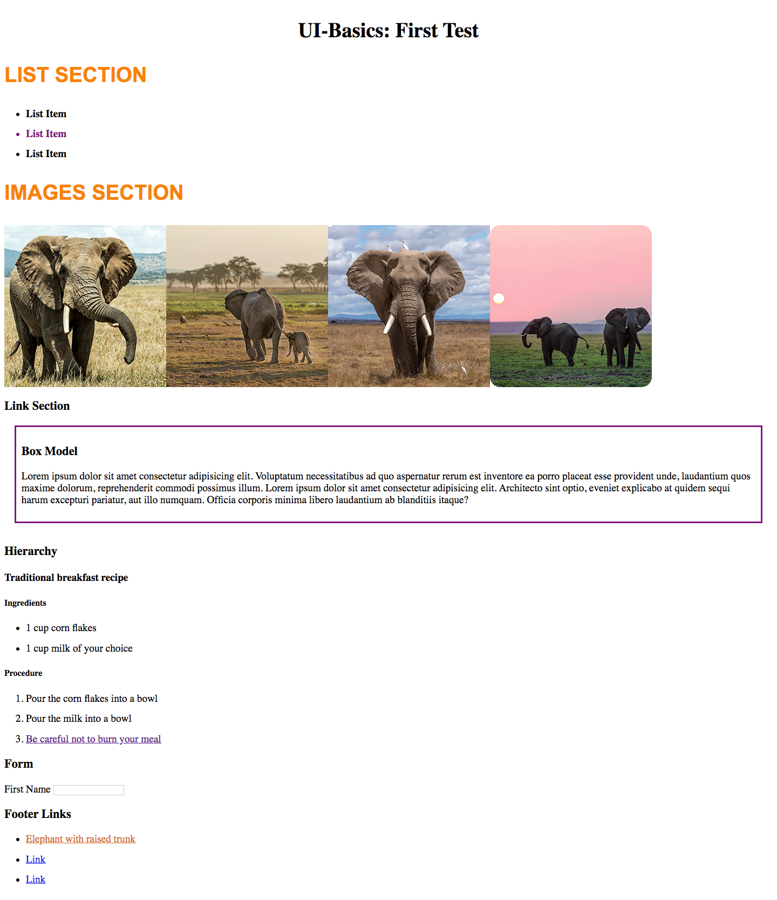

# UI-Basics Test: First Test

* There are a total of 42 possible marks. A passing grade is 12 marks.

* You can use Google and the class resources in Airtable, but you cannot ask your classmates for help.

* The order of CSS rules in your document will not affect marks, as long as the correct styles are applied in the browser.

* You may use Git if you wish, but it is not required.

* Good luck!

## The goal

Your aim is to end up with a responsive website that looks like these screenshots. (Browser / OS differences are expected and will not affect marks. The screenshots were taken in Chrome on Mac)

## Starting Up

0. (1 mark) Work from the `index.html` file and a CSS stylesheet.

## Content Styling

1. (2 marks) Set the text size on the `html` element:

    a. by default, set it to 100%.

    b. Use a media query to set the text size it to `120%` on viewports that are 568px or wider.

2. (1 mark) Align the text in the header to the center of the page.

3. (2 marks) In the `list` section:

    a. Apply a bold style to all the list items.

    b. Change the color of the second list item to purple.

4. (3 marks) In the `images` section, use **flexbox** to achieve the following:

    a. Make all of the images appear side-by-side.

    b. When there is not enough space to fit them on the screen, they **should** wrap onto a new line, and they **should not** shrink.

5. (2 marks) Give the class `accent` to the first two `h3` elements in the HTML document.

6. (6 marks) Use CSS to apply the following styles to elements with the `accent` class:

    a. Change the text color to orange using rgb() syntax.

    b. Set the size of the text to `2em`.

    c. Set the preferred font to `Arial`.

    d. Set an appropriate fallback font.

    e. Make the text appear in uppercase.

## Box Model

7. (2 marks) Add a 3px solid purple border to the `box-model` section.

8. (2 mark) Add half an `em` of whitespace inside the border.

9. (2 marks) Use **one shorthand property** to set the following whitespace outside the border:

    * 1em on the top, left and right
    * 2em on the bottom

## Images & Links

10. (3 marks) In the `images` section:

    a. Use an `img` element to display the unused image from the images folder. Follow the same format as the existing images.

    b. Make the image appear rounded using `em`.

11. (2 marks) Change one of the footer links to the HTML equivalent of this markdown link: [Elephant with raised trunk](https://unsplash.com/photos/cbNVRnlntZ8)

12. (1 mark) Make the above link open in a new tab.

## Hierarchy

13. (2 marks) In the `hierarchy` section, change the `p` tags to headings of appropriate levels. For this question, **semantic correctness** is what counts, not style.

## Form

14. (3 marks) In the `form` section of the HTML, create a `label` element for the existing text input. Check that:

    a. The label looks like the screenshots provided.

    b. The `label` is connected to the `input` in **two different ways** for optimal accessibility.

## Footer

15. (1 mark) Move the `footer` section after the `main`. Be careful with your indentation.

16. (3 marks) Select all descendant links in the footer. Change the links' color to `chocolate` on `visited` and `gold` on `hover`.

## Wrapping up

* (2 marks) Make sure your HTML and CSS are valid.
* (2 marks) Make sure your HTML and CSS are each indented consistently.
* Make sure you have addressed all questions.
* Check that your result looks as close as possible to the screenshots provided.
